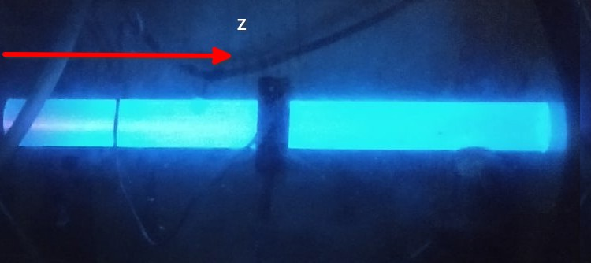
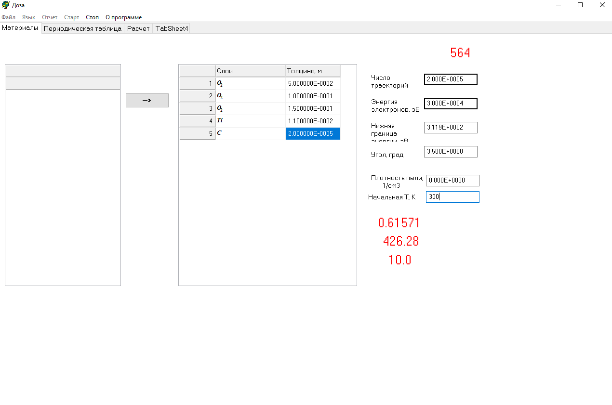
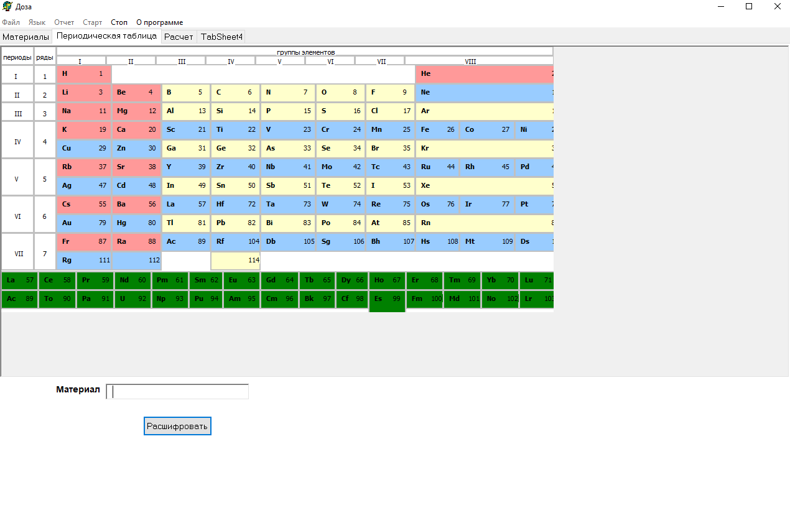
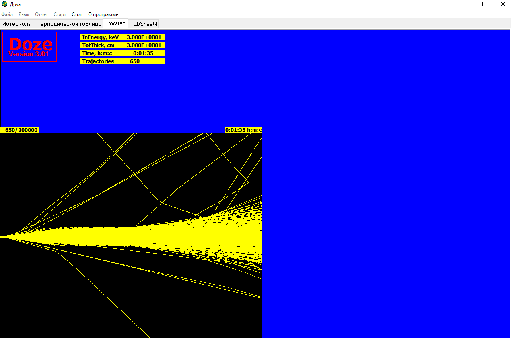
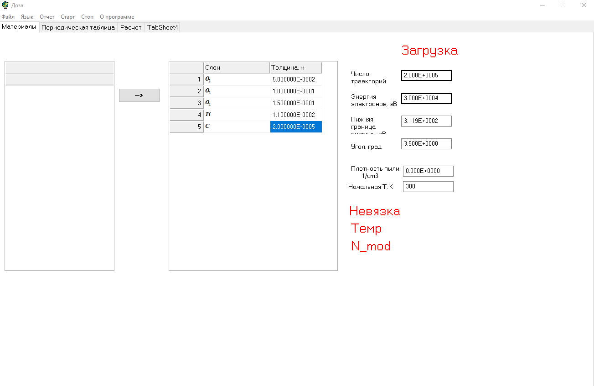
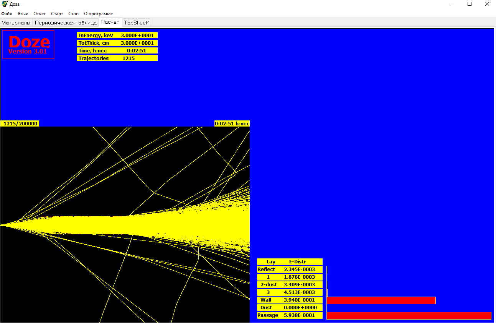
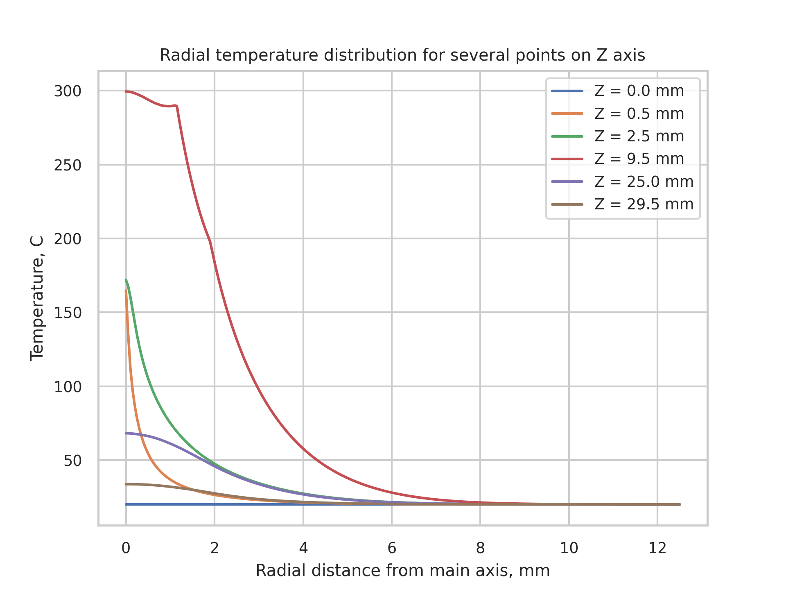
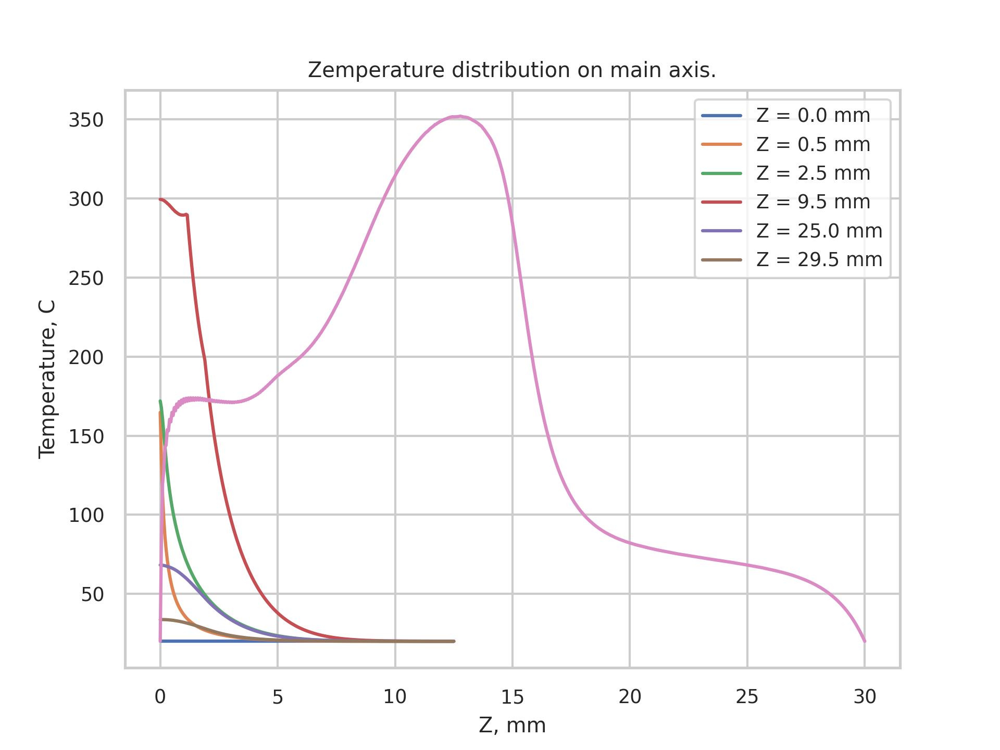

## Обоснование работы

В настоящее время одним из основных направлений в развитии практически всех отраслей современной техники и технологии является широкое использование полимеров и изделий на их основе. Так, высокомолекулярные соединения являются активными компонентами, входящими в состав конструкционных и функциональных материалов нового поколения для радио- и оптоэлектроники, аэрокосмических технологий, пищевой и фармацевтической промышленности, биологии и медицины. Однако, обладая ценными объемными физико-химическими характеристиками (низкая плотность, высокие эластичность и удельная прочность, и др.), полимеры зачастую не имеют оптимальных поверхностных свойств (плохо смачиваются водой и другими растворителями, имеют низкую адгезию к подложкам и напыленным покрытиям, живым клеткам и тканям). Кроме того, во многих случаях требуются функционально-градиентные материалы (ФГМ) с заданным пространственным распределением микроструктурных компонентов и/или химического состава.

Одиним из методов придания образцам требуемых свойств является их обработка путем систематического взаимодействия на них пучком заряженных электронов. Однако плазменная обработка полимерных изделий является сложным и многопараметрическим процессом. При работе с плазмой необходимо правильно настроить режимы, чтобы обеспечить оптимальные условия для обработки без повреждения или выгорания образца.

Одной из основных сложностей при подборе параметров плазменной обработки является неоднородность плазмы и ее воздействие на поверхность образца. Различные факторы, такие как мощность, давление, состав газовой смеси и время обработки, могут оказывать значительное влияние на процесс и результаты обработки. Подбор оптимальных значений для каждого из этих параметров требует экспериментов и опыта.

Предварительное моделирование играет важную роль в оптимизации плазменной обработки полимерных изделий. С помощью компьютерных моделей и симуляций можно предсказать воздействие плазмы на поверхность образца и оптимизировать параметры обработки. Моделирование позволяет избежать выгорания образца, поскольку можно провести виртуальные эксперименты с различными параметрами без реального воздействия на материал.

Однако необходимо отметить, что моделирование может предоставить только предположения и приближенные результаты, так как физические процессы в плазме достаточно сложны и могут иметь множество переменных. Поэтому предварительное моделирование должно подтверждаться реальными экспериментами для достижения оптимальных результатов.

<p class="imgp">

</p>

## Методика компьютерного моделирования (С.Л. Лысенко)

Вычислительные эксперименты проводятся с целью установления зависимости параметров, характеризующих условия химико-термического воздействия электронно-пучковой плазмы на поверхность обрабатываемого образца, от параметров электронного пучка, плазмообразующего газа и от геометрии обрабатываемого образца. При этом следует использовать методику компьютерного моделирования, согласно которой самосогласованным образом рассматриваются следующие процессы:

- рассеяние быстрых электронов в газе и твердом теле;
- нагрев плазмообразующего газа за счет частичной диссипации энергии первичных электронов при их торможении в газе;
- отражение и поглощение электронов пучка поверхностью образца;
- нагрев образца бомбардировкой быстрыми электронами пучка и электронами промежуточных энергий, образующихся при генерации ЭПП;
- теплообмен теплопроводностью между образцом и окружающим газом;
- лучистый теплообмен между внешней поверхностью образца и стенками рабочей камеры;
- перетекание тепла в осевом и радиальном направлениях за счет теплопроводности плазмообразующего газа и материала обрабатываемого изделия;

Распространение электронного пучка в плотных средах, как в газе, так и в материале образца, численно моделируются методом Монте Карло в граничных условиях, определяемых постановкой задачи. В нашем конкретном случае область моделирования заполнена газом, снаружи ограничена цилиндром заданного радиуса, а внутри нее могут располагаться подобласти с существенно большей плотностью среды (плотность твердого тела) соответствующие обрабатываемому образцу.

Распространение электронного пучка в исследуемой области вызывает ее нагрев, при этом считается, что внешние границы этой области поддерживаются при температуре равной температуре окружающей среды. Как результат нагрева в такой области за счет теплопроводности и излучения твердых поверхностей формируется неоднородное распределение температуры в исследуемой области. Неоднородная температура газа вызывает неоднородное распределение плотности этого газа. Таким образом электронному пучку приходится распространятся в неоднородной газовой среде неоднородность которой вызванна распространением этого же пучка. В этом случае при моделировании приходится решать самосогласованную задачу.

Для решения уравнения теплопроводности и накопления статистических данных при моделировании движения электронов используется равномерная расчетная сетка в цилиндрической системе координат, которая покрывает всю область моделирования. Размеры ячейки задавались исходя из требуемой точности решения уравнения теплопроводности. При моделировании шаг движения электрона по траектории задается в несколько раз меньше, чем размер расчетной сетки. Это способствуето дополнительному повышению точности вычисления поглощенной мощности и, соответственно, точности решения уравнения теплопроводности.

Электронные траектории начинают прослеживаться от выходного отверстия газодинамического окна. В выходном сечении выводного окна задается случайное направление движения электрона с углом отклонения от оси инжекции \\(\\theta\\) , диапазон изменения среднеквадратичной величины которого \\(\\theta_0\\) определялся конструкцией и режимом работы окна и составляет 0-10 град. Движение электрона прослеживается до границ области моделирования, либо до тех пор, пока энергия электрона не становилась меньше 150 эВ. В последнем случае предполагается, что оставшаяся у электрона энергия поглощается в той точке пространства, в которой она стала меньше 150 эВ.

## Алгоритм работы программы

Вычислительный эксперимент представляет собой последовательность следующих шагов.

1. Задание общих параметров расчета:

   - число траекторий,
   - начальная энергия электрона,
   - ток электронного пучка,
   - среднеквадратичная величина начального углового разброса направления движения быстрого электрона θ0,
   - геометрия задачи (численные значения величин (D, L, d, l, h, z0)
   - физические свойства используемых материалов и газов,
   - давление и начальная температура газа,
   - температура на границе моделируемой области.

2. Формирование начальных параметров траектории электрона

   - начальные координаты электрона (случайный разброс по сечению выводного окна)
   - начальное направление движения

3. Розыгрыш случайной величины ξ, после чего прослеживается движение электрона в заданном направлении до тех пор, пока не выполнится условие, которое определяет длину пробега. Траектория электрона прослеживается шагами меньшими, чем длина пробега, при этом на пути движения электрона может происходить изменение свойств среды (давление, температура), пересечение границ областей (изменение плотности). В процессе моделирования траектории контролируется положение электрона относительно границ областей. На каждом шаге вычисляются потери энергии и складываются в определенные ячейки памяти.
4. По достижении длины пробега s, вновь разыгрывается случайная величина ξ и определяется новое направление движения относительно предыдущего направления.
5. Процедуры 3 и 4 повторяются пока энергия электрона больше нижней пороговой энергии (150 эВ) либо до достижения границы исследуемой области. Происходит завершение моделирования траектории электрона.
6. Совершается однократная прогонка метода релаксации. Определяется температурное поле исследуемой области.
7. Процедуры 2-6 повторяются до тех пор, пока число траекторий не достигнет заданного.
   Результатом моделирования является температурное поле исследуемой области и пространственное распределение поглощенной мощности. После этого можно найти распределения концентраций частиц плазмы во всей области моделирования, в том числе, конечно, – вблизи обрабатываемой поверхности образца, и вычислить потоки химически активных частиц плазмы на поверхность образца.

## Цель работы

Целью данной работы будет заключаться моделирование эксперимента распространения ЭПП в объеме, ограниченном титановой трубкой для определения оптимальных параметров, позволяющих получить достаточное поглащение энергии трубкой (не менее 30% от общего энерговыделения) при избежании термического повреждения образца.

## Методика выполнения работы

### Моделирование

Моделирование движения электронов в произвольных средах осуществляется при помощи модифицированной программы «Доза» (С.Л. Лысенко).
Программа имеет следующую структуру (папка `./doza`):

```txt
doza
  System/
    Table.tbl           -- Таблица параметров элементов
    Temp.txt            -- Выходные данные программы
    plot.py             -- Построение графиков
  Data/
    example.lvl         -- Предустановленные слои
  PDoza.exe             -- Основной исполяемый файл
```

Запустите `PDoza.exe`.


<p class="imgp">

</p>

Перед вами будет интерфес для ввода параметров эксперимента. Есть два способа заполнения данных:

- Использование предустановленного слоя которые можно найти в `./Data`
- Использование таблици второй вкладки для ручного задания слоев "с нуля"

Также для проведения эксперимента необходимо задать параметры электронного пучка и среды:

- Число траекторий для достаточной точности было найдено эмпирически и должно быть не менее
2000
- Начальную температуру следует задавать как комнатную. Все остальные параметры должны быть подобраны.

<p class="imgp">

</p>

Также на третей вкладке можно в живом режиме наблюдать моделируемые траектории

<p class="imgp">

</p>

В любой момент можно остановить программу, данные при этом не будут утеряны.


<p class="imgp">

</p>

### Анализ модели и параметров

После остановки на графике можно видеть рапределение поглащенной энергии

<p class="imgp">

</p>

Также программа выдает данные распределений энергии, заряда и температуры в 
виде матрицы в циллиндрических координатах `./System`:

```txt
Charge.txt
Power.txt
Temp.txt
```

Для построения графиков распределения температуры в радиальном направлении (для нескольких плоскостей, 
перпендикулярной главной оси) и на главной оси можно использовать `./System/plot.py`.


<p class="imgp">

</p>

<p class="imgp">

</p>
